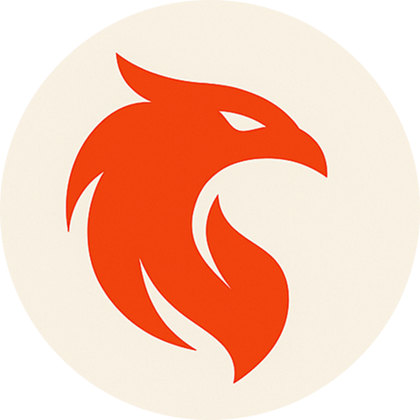
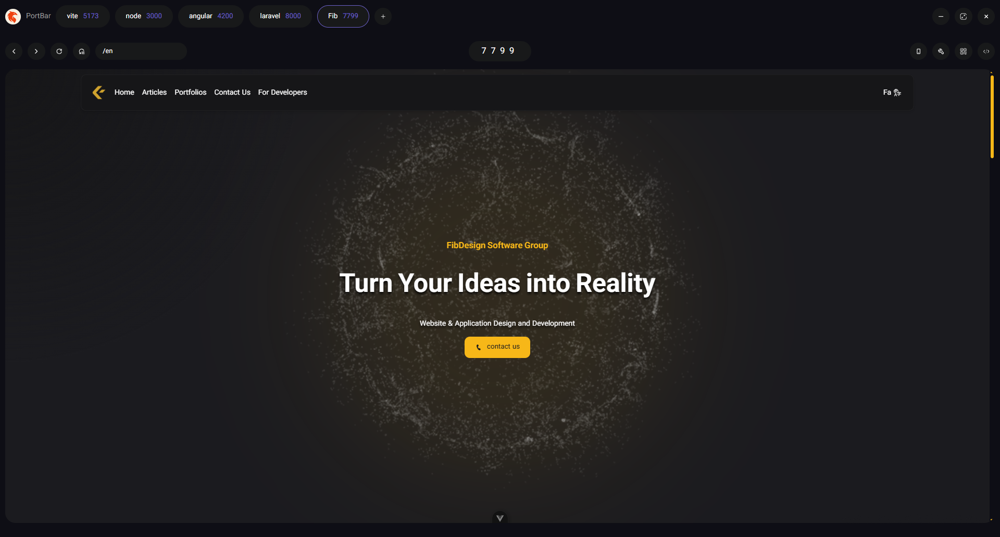

  

# Fynx — Local Dev Browser

**Fynx** is a lightweight, local-first developer browser built with **Electron** and **Vue 3**.
It provides a streamlined single-window environment for working with local ports, inspecting JSON, and using popular web-based developer tools — all in one place.

## 🚀 Download

Grab the latest prebuilt installer for Windows:

👉 [**Download Fynx (.exe)**](https://fynx.fidesign.ir/download/)

After downloading, simply run the `.exe` file to install Fynx.

## ✨ Features

- **Single-window environment** for testing local ports.
- **JSON auto-detection** with a built-in formatted viewer.
- **Port management**: add, rename, remove, and remember the last used port.
- **Integrated developer tools** (inspect elements, console, etc.).
- **Quick Dev Links**: access commonly used dev tools directly.
- **QR code sharing**: share the current link instantly with devices on the same network.
- **Mobile View**: View the app in mobile screen size (vertical and horizontal).

## 🤝 Contributing

Fynx is **open-source** and community-driven — contributions are always welcome!

Ways you can help:
- Submit bug fixes or new features via Pull Requests.
- Suggest useful dev tool integrations.
- Improve layout, UI, or performance.

💌 Interested in contributing or collaborating?
Reach out at [msghaderi99@gmail.com](mailto:msghaderi99@gmail.com).

## Screenshots

  

